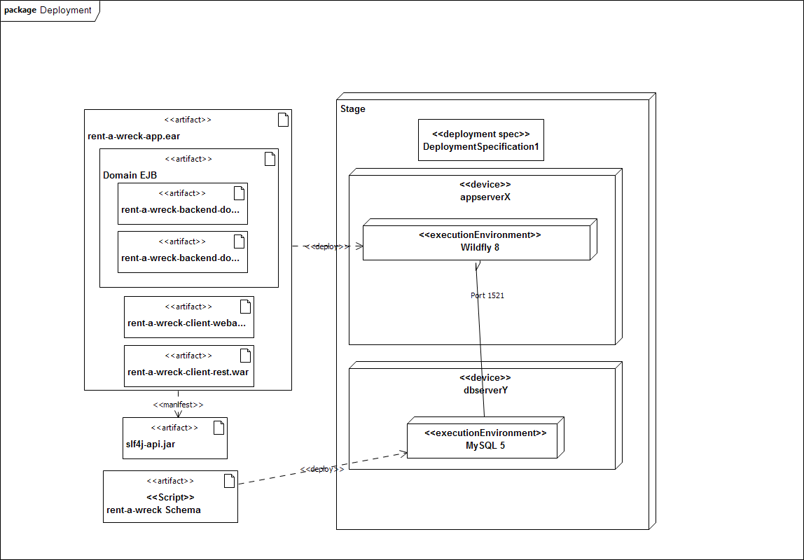

# rent-a-wreck - Developer Guide

## Architecture

### Software Architecture
The application follows the classical 3 tier approach - client, server, database.

#### Client
The client is a HTML5 web application based on the JavaScript framework AgularJS. The communication to the backend 
happens through a REST API provided by the server.

### Server
The server uses JEE 7 features for the implementation of the business logic  - EJB 3.2, CDI and JPA.

There is a EJB for each domain. All domain EJBs share a common EJB.

### Database
Application data will be persisted in a SQL database. The server implementation uses JPA. Therefore all major SQL 
databases are supported.

## System Architecture

### Client / Server
Wildfly 8 is the targeted application server of this project.

### DB
During development HSQL is used. In production it will be exchanged by MySQL.

## Tools

### SCM
This project uses Git. There is only one repository for the complete project. 

It is currently hosted on GitHub.

### Build and Dependency Management
Maven 3.x

### Continous Integration
Travis

### Artifact Repository
GitHub

## Development

### Environment Setup

1. Setup local development environment

For local development you will need the following:

* A IDE of your choice (see [IDE](###IDE))
* JAVA SE 7
* Maven 3.x
* git
* JBoss Wildfly 8
* MySQL 5.x

2. Create a for of the main git repository https://github.com/oteichmann/rent-a-wreck

### IDE

Preferred IDE is Eclipse (Kepler). As it was used for development...

Please configure your Eclipse to use the given Code Formatter and Cleanup Settings for Java and JavaScript.
* [Java Code Formatter](./development/resources/eclipse-java-code-formatter.xml)
* [Java Code Cleanup](./development/resources/eclipse-java-code-cleanup.xml)
* [JavaScript Code Formatter](./development/resources/eclipse-javascript-code-formatter.xml)
* [JavaScript Code Cleanup](./development/resources/eclipse-java-code-cleanup.xml)

It is strongly recommended to also implement the cleanup settings as save actions for the Java and JavaScript editors.

Do also configure all other used editors to the following formatting rules:
* Indentation: Always use tabs!
* Line wrapping: Always use a 120-column line width.

_If you prefer to use another IDE feel free to do so. But please make sure the code matches all of the Eclipse 
formatting rules._

## Coding Guidelines

